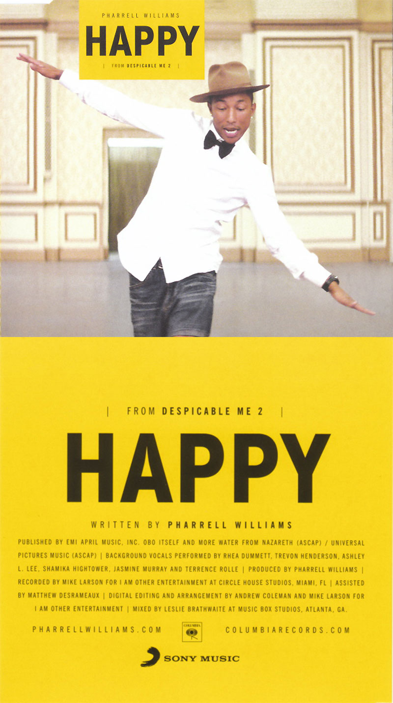

# HTML Album Cover

## Problem Statement

Learning all the individual pieces that make up a web page is a necessary first
step in the process of learning HTML, but one of the best ways to solidify the
concepts we've learned is to apply concepts together. In this lab, your task
will be to update `index.html` based on commented notes in the file, using what
we've learned about text formatting and displaying images.

## Objectives

- Practice applying header, paragraph, image and span tags

## The Mock Up

Pharrell isn't quite happy, he needs some help coding the album cover for his
hit song "Happy." His dev chops aren't quite as skilled as yours, so he's hired
you to take care of business.

Pharrell did provide us with a mock up of what he would like to see for the
design of the album cover:

In the industry, frontend developers are typically given specs just
like this from the product team and then asked to write the code to make a
website look just like the spec. Today, you're the developer and Pharrell is
the product team.

### SOURCE.md

Pharrell has provided us with the text for the album and all the legal
mumbo-jumbo to give credit where credit is due. You can find that text in
`SOURCE.md`. Again, this is a typical industry standard workflow, where the
developers are given copy for the site from the product team.

Each line of text in this file corresponds to a note in `index.html` that will
indicate where you'll need to add this information. It will be up to you to pick
which HTML tags to use.

### Getting To Work

Write your code in `index.html`. Your job is to make sure the text from
`SOURCE.md` makes it into `index.html` surrounded by the appropriate HTML tags.

The files you need are provided in the 'images' folder, but you'll have to write
the correct _relative paths_ in order for them to display correctly.

Run `httpserver` and copy the IP address it provides to see the album cover as
you build it.

To run the tests, hit `ctrl`+`C` to stop the server, then run `learn` to make
sure you've met all the deliverables and passed the tests. When you're finished,
run `learn submit` to submit your work.

---

_Clap along if you feel_ you're getting the hang of HTML!

View <a href='https://learn.co/lessons/html-album-cover' title='HTML Album Cover'>HTML Album Cover</a> on Learn.co and start learning to code for free.

